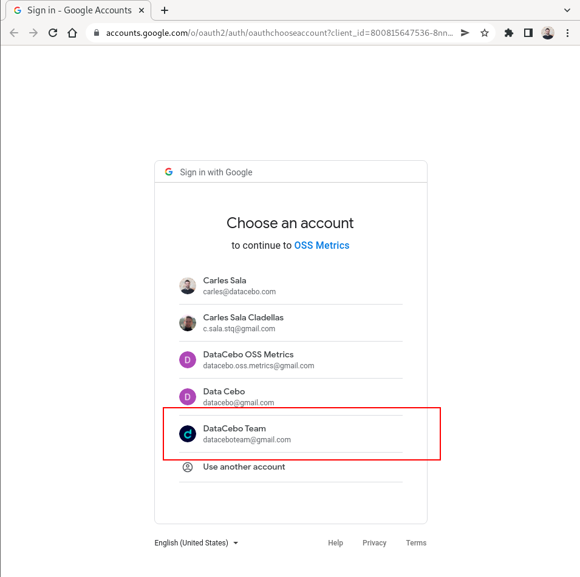
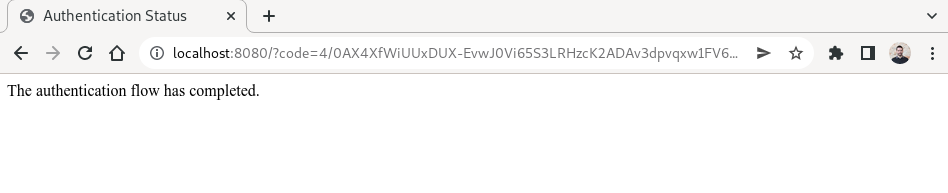
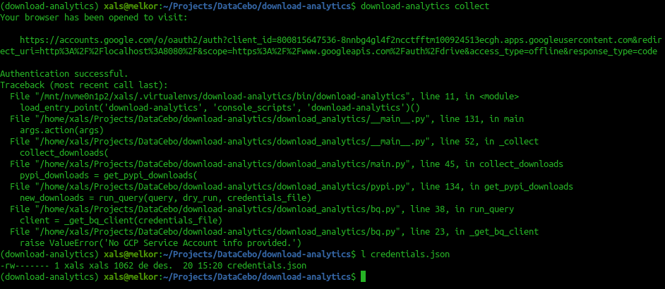
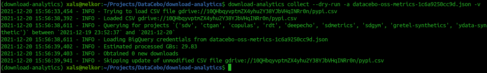
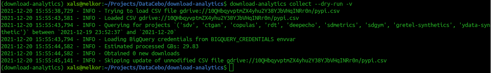
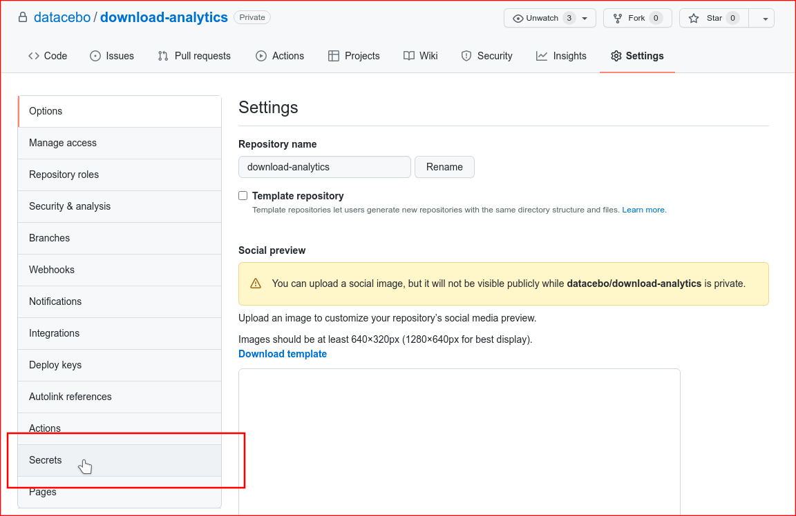
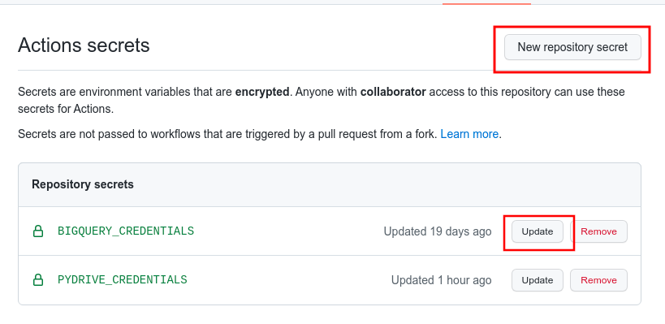
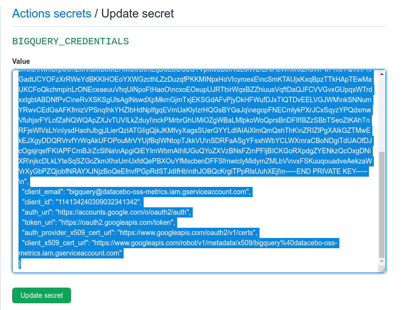

# Download Analytics Setup

The Download Analytics project requires privileged access to the following resources:
- Google Drive, which is accessed via the `PyDrive` library.
- Google Big Query, which is accessed via the `google-cloud-bigquery` library.

In this document we cover how to generate generate and configure credentials to authenticate
with these two services.

## Local Setup

### PyDrive Cretentials

In order to authenticate with Google Drive you will need the OSS Metrics GCP application keys,
which should be stored in a `settings.yaml` file within the project folder with the following
format:

```yaml
client_config_backend: settings
client_config:
  client_id: <client-id>
  client_secret: <client-secret>

save_credentials: True
save_credentials_backend: file
save_credentials_file: credentials.json
```

**IMPORTANT**: Notice that this file should never be committed alongside the code, since
if contains the application KEY which should never be made public.

Once the file is created, you can follow these steps:

1. Run the `pymetrics collect-pypi` command. If the `settings.yaml` file has been properly
   created, this will **open a new tab on your web browser**, where you need to authenticate.

   |  |
   | - |

2. Click on the Google account which you which to authenticate with. Notice that the account that
   you use must have access to the [Download Metrics folder on Google Drive](
   https://drive.google.com/drive/u/0/folders/10QHbqyvptmZX4yhu2Y38YJbVHqINRr0n), and that by
   default the account used should be `dataceboteam@gmail.com`.

   |  |
   | - |

3. Once you click on the selected account, a message indicating that the authentication flow
   has completed will appear, and a `credetials.json` file will have been created in your
   working directory.

   **NOTE**: If you have not configured the Big Query access, an error message about `GCP` will
   show up, as shown in the screenshot below. You can ignore this error and move on to the next
   step.

   |  |
   | - |

   |  |
   | - |

### Big Query Credentials

In order to execute queries on Big Query you need to use an authentication json file, which must
be provided to you by a privileged admin.

Once you have this JSON file, you have two options:

1. Pass the path to the authentication file with the `-a` or `--authentication-credentials`
   argument to the `pymetrics collect-pypi` command.

   |  |
   | - |

2. Export the contents of the credentials file into a `BIGQUERY_CREDENTIALS` environment variable

   |  |
   | - |


## Github Actions Setup

When using Download Analytics via Github Actions, the authentication credentials for Google
Drive and Big Query must be passed as repository `secrets`, which will later on be declared
as environment variables.

1. Open the [Settings page of the Download Analytics repository](
   https://github.com/datacebo/pymetrics/settings/secrets/actions) and click on `Secrets`.

   |  |
   | - |

2. If the `secret` that you will create does not exist yet, click on `New Repository Secret`,
   otherwise click on the `Update` button of the corresponding secret to update its value.

   |  |
   | - |

3. Paste the contents of the credentials JSON file in the box and click update. The following
   secrets need to be created for each credentials file:
   - `PYDRIVE_CREDENTIALS` for the `credentials.json` file that you created in the steps above.
   - `BIGQUERY_CREDENTIALS` for the Big Query credentials JSON file provided to you by the
      administrator.

   <br/>

   |  |
   | - |
