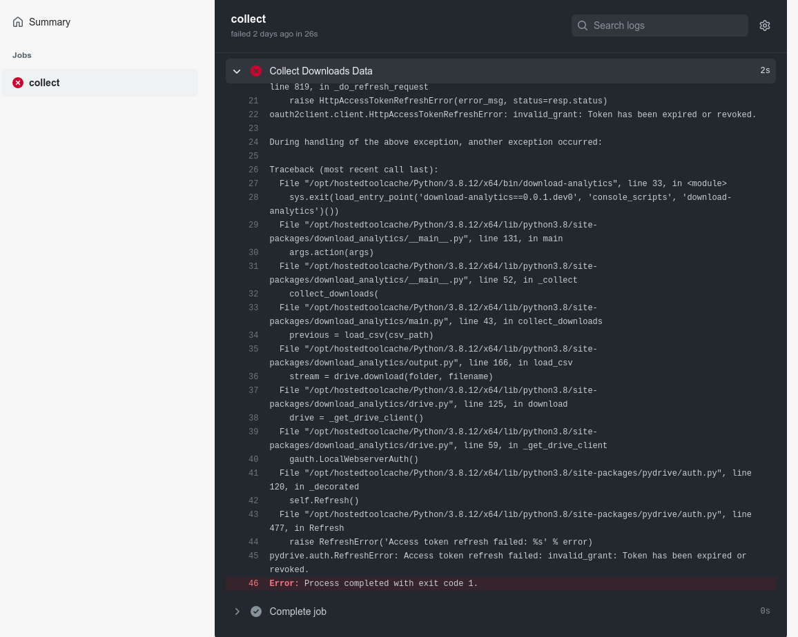

# PyMetrics Workflows

This document describes how to perform the two most common workflows:

- **Daily PyPI Collection**: Adding one or more libraries to the GitHub Actions configuration
  to download data daily.
- **One Shot**: Collecting download data for one or more libraries over a specific period
  using GitHub Actions.

## Daily Collection - Adding libraries to the scheduled GitHub Actions workflow

Every day at 00:00 UTC time, new data is collected from all the configured sources.

The configuration about which libraries are collected is written in the [config.yaml](
../config.yaml) file, which has the following format:

```yaml
# Name or Google Drive ID of the output folder
output-path: gdrive://10QHbqyvptmZX4yhu2Y38YJbVHqINRr0n

# Maximum number of days to include in the query
max-days: 7

# List of filenames and projects to include in them
projects:
  - sdv
  - ctgan
  - copulas
  - rdt
  - deepecho
  - sdmetrics
  - sdgym
  - gretel-synthetics
  - ydata-synthetic
```

In order to add a new library to the collection, you need to follow these steps:

1. Open the [config.yaml](../config.yaml) file to edit it. If you do this directly on the GitHub
   UI, you can edit the file directly by clicking on the pencil icon at the top right corner.

   |  |
   | - |

2. Add the libraries that you want to track to the list under `projects`. Make sure to replicate
   the same indentation as the existing libraries and use the exact same name as the corresponding
   `https://pypi.org` and `https://pepy.tech` project pages; otherwise, the project downloads
   will not be found.

   For example, in the screenshot below, we would be adding the library [DataSynthesizer](
   https://pypi.org/project/DataSynthesizer/):

   |  |
   | - |

3. Save the file, commit it, and create a Pull Request. If you are editing the file directly
   on GitHub, all these steps can be done at the same time using the form at the bottom of
   the file.

   |  |
   | - |

After these steps are done, the Pull Request will be ready to be validated and merged, and
after it is merged, the downloads of the new library will start to be added to the output CSV file.

## One Shot - Collecting data over a specific period.

PyMetrics is prepared to collect data for one or more libraries over a specific period
using a [GitHub Actions Workflow](https://github.com/datacebo/pymetrics/actions/workflows/manual.yaml).

In order to do this, you will need to follow these steps:

1. Enter the [GitHub Actions Section of the repository](https://github.com/datacebo/pymetrics/actions)
   and click on the [Manual Collection Workflow](https://github.com/datacebo/pymetrics/actions/workflows/manual.yaml).

   |  |
   | - |

2. Click on the `Run workflow` dropdown to show the optional arguments.

   |  |
   | - |

3. Provide the following information in the corresponding boxes.

| Argument | Example | Description |
| -------- | ------- | ----------- |
| **Project(s)** | `sdv copulas ctgan` | The project or projects that need to be collected, separated by spaces. If left empty, all the projects included in the `config.yaml` file will be collected. |
| **Google Folder ID** | `10QHbqyvptmZX4yhu2Y38YJbVHqINRr0n` | The ID of the folder where results will be stored. In most cases, the default does not need to be changed. |
| **Max Days** | 30 | Maximum number of historical days to collect. If a `start-date` is provided in the extra args, this is ignored. |

Additionally, the `Extra Arguments` box can be used to provide any af the following options,
as if they were command line arguments:

| Argument | Example | Description |
| -------- | ------- | ----------- |
| **Dry Run** | `--dry-run` | Simulate the execution to validate the arguments, but do not actually run any query on BigQuery |
| **Start Date** | `--start-date 2020-01-01` | Used to indicate a date from which data will be collected, in ISO format `YYYY-MM-DD`. This overrides the `max-days` setting. |
| **Force** | `--force` | Ignore the data that has been previously collected and re-collect it. This is necessary to cover gaps that may exist in the previous data. |
| **Add Metrics** | `--add-metrics` | Apart from collecting the raw downloads, compute the aggregation metrics. This is activated and already entered in the box by default. |

For example, to force the collection of data for `sdv` and `ctgan` since `2021-01-01` while also
computing the metrics for all the existing data, we would run using this configuration:

   |  |
   | - |

4. Click on the green `Run workflow` button and wait for the workflow to finish.


### Debugging workflow errors.

If a workflow execution succeeds, a green tick will show up next to it. Otherwise, a red cross
will show up. In this case, you can try to see the logs to understand what went wrong by
following these steps:

1. Click on the failed workflow execution.

   |  |
   | - |

2. Click on the `collect` box in the center of the screen.

   |  |
   | - |

3. Expand the `Collect Downloads Data` section and scroll to the end to see the error.

   |  |
   | - |

4. In this case, we can see that the error was that the PyDrive credentials had expired and had
   to be regenerated.

